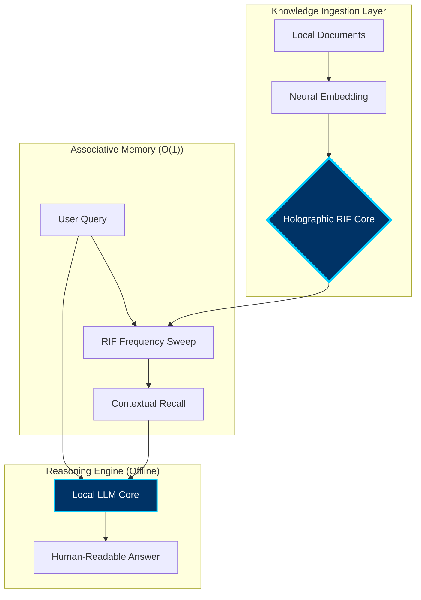

#  Kalpanā Desktop | Public Beta
### *Private, Offline AI for Everyone.*

---

## 🌟 What is Kalpanā?
Kalpanā is a high-performance local AI engine that allows you to chat with your documents (PDF, Text) with **100% privacy**. No data ever leaves your computer, and no internet is required.

It is powered by the proprietary **RIF (Resonant Interference Field)** memory core, which replaces standard AI memory bottlenecks with a fixed-footprint holographic state.

---

## 📐 System Architecture
Kalpanā utilizes a sophisticated **Hybrid-Core Architecture** that decouples memory from reasoning:

## 🧠 How it Works: RIF Technology
Traditional AI models suffer from the **"KV-Cache Bottleneck"**—as you give the AI more information, it becomes exponentially slower and consumes more RAM.

**Kalpanā solves this using the Resonant Interference Field (RIF):**
1.  **Vector Conversion:** Documents are transformed into high-dimensional frequency waves.
2.  **Holographic Storage:** These waves are "recorded" into a fixed-size holographic field.
3.  **Instantaneous Recall:** When you ask a question, the engine performs a "Temporal Sweep" of the field, recalling relevant facts in constant time ($O(1)$), regardless of the library size.

---

## 🚀 Download & Install

### **🍏 macOS**
1.  Go to the **[Releases](https://github.com/maduperera/Kalpana-Desktop/releases)** section of this repository.
2.  Download **`Kalpanā-Mac.zip`**.
3.  Unzip and drag **Kalpanā.app** to your Applications folder.
4.  Double-click to launch!

### **🪟 Windows**
*   *Coming Soon!* The Windows installer is currently in final testing.

---

## 🛠 Features
*   **Fully Offline:** Run AI models on your own CPU.
*   **Holographic Memory:** Instant recall from thousands of pages using the O(1) RIF engine.
*   **Knowledge Packs:** Organize your research into portable, secure packs.

---

## ⚖️ Intellectual Property & Licensing
**Patent Pending:** Sri Lanka Patent Application No. LK/P/1/24089  
**Copyright © 2026 Vijñāna AI.** All rights reserved.

The software is provided as a compiled binary for evaluation purposes. Reverse engineering, decompilation, or unauthorized distribution is strictly prohibited.

---

## 📧 Support
For feedback or business inquiries:  
👉 [**support@vijñānaai.com**](mailto:support@vijñānaai.com)

**Intelligence, Localized.**
