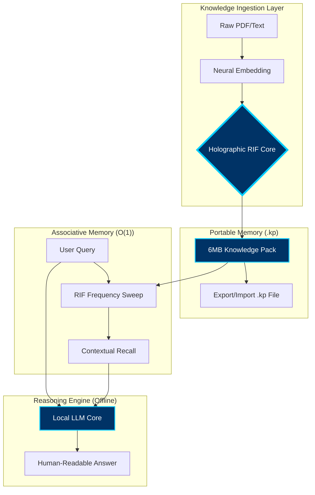

#  Kalpanā Desktop | Public Beta
### *Private, Offline AI for Everyone.*

---

## 🌟 What is Kalpanā?
Kalpanā is a high-performance local AI engine that allows you to chat with your documents (PDF, Text) with **100% privacy**. No data ever leaves your computer, and no internet is required.

---

## 📐 System Architecture
Kalpanā utilizes a sophisticated **Hybrid-Core Architecture** that decouples memory from reasoning:

## 🧠 How it Works: RIF Technology
Traditional AI models suffer from the **"KV-Cache Bottleneck"**—as you give the AI more information, it becomes exponentially slower and consumes more RAM.

**Kalpanā solves this using the Resonant Interference Field (RIF):**
1.  **Vector Conversion:** Documents are transformed into high-dimensional frequency waves.
2.  **Holographic Storage:** These waves are "recorded" into a fixed-size holographic field.
3.  **Instantaneous Recall:** When you ask a question, the engine performs a "Temporal Sweep" of the field, recalling relevant facts in constant time ($O(1)$), regardless of the library size.

---

## 📊 Performance Specifications
Kalpanā is engineered for extreme efficiency on consumer hardware:
*   **Memory Density:** Each Knowledge Pack is compressed into a tiny **6MB footprint**.
*   **Massive Capacity:** A single 6MB pack can store up to **3 Million tokens** of information.
*   **Total Portability:** Knowledge is stored in **.kp files**, which can be easily exported and imported between devices via the Kalpanā interface.

---

## 🚀 Download & Install

### **🍏 macOS**
1.  Go to the **[Releases](https://github.com/maduperera/Kalpana-Desktop/releases)** section of this repository.
2.  Download **`Kalpanā-Mac.zip`**.
3.  Double-click the zip to extract the **Kalpanā.app**.
4.  **Important:** Since this is a beta, right-click **Kalpanā.app** and select **Open**. (If Mac shows a security warning, click "Open anyway").
5.  Drag the app to your **Applications** folder for permanent use.

---

## ⚖️ Intellectual Property & Licensing
**Patent Pending:** Sri Lanka Patent Application No. LK/P/1/24089  
**Copyright © 2026 Vijñāna AI.** All rights reserved.

The software is provided as a compiled binary for evaluation purposes. Reverse engineering, decompilation, or unauthorized distribution is strictly prohibited.

---

## 📧 Support
For feedback or business inquiries:  
👉 [**support@vijñānaai.com**](mailto:support@vijñānaai.com)

**Intelligence, Localized.**
