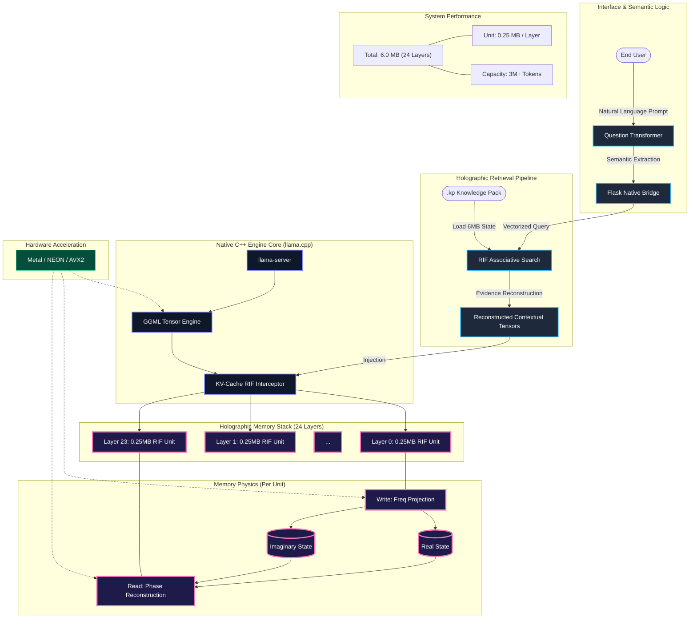

# Kalpanā Desktop | Public Beta
### *Private, Offline AI for Everyone.*

---

## 🌟 What is Kalpanā?
Kalpanā is a high-performance local AI engine that allows you to chat with your documents (PDF, Text) with **100% privacy**. No data ever leaves your computer, and no internet is required.

---

## 📐 System Architecture: The Full-Stack Intelligence Pipeline
Kalpanā v3.0.5 combines high-level semantic reasoning with a vectorized **C++ Native Engine**. The following diagram illustrates the journey from a Natural Language Prompt to a sub-millisecond holographic memory reconstruction.

---

## 🧠 How it Works: RIF Native Technology
Traditional AI models suffer from the **"KV-Cache Bottleneck"**—as conversations grow, the model becomes exponentially slower and consumes massive RAM.

**Kalpanā solves this using the native C++ Resonant Interference Field (RIF):**
1.  **Semantic Projection:** Prompt signatures are transformed into frequency waves via the **Question Transformer**.
2.  **Holographic Compression:** Each model layer (24 total) stores its attention state in a tiny **0.25 MB** interference unit.
3.  **Direct Tensor Hooking:** The engine hooks directly into the `ggml` pipeline, reconstructing KV-tensors in constant time ($O(1)$) with near-zero latency using SIMD acceleration (Metal/NEON).

---

## 📊 Performance Specifications
Kalpanā is engineered for extreme efficiency on consumer hardware:
*   **Memory Density:** Each Knowledge Pack is compressed into a tiny **6MB footprint**.
*   **Massive Capacity:** A single 6MB pack can store up to **3 Million tokens** of information.
*   **Total Portability:** Knowledge is stored in **.kp files**, which can be easily exported and imported between devices via the Kalpanā interface.

---

## 💻 Cross-Platform Architectural Equivalence

Kalpanā is designed to provide a consistent experience across different operating systems. Whether running as a macOS `.app` or a Windows `.exe`, the underlying intelligence and memory architecture remain identical.

| Feature | macOS (.dmg) | Windows (.exe) |
| :--- | :--- | :--- |
| **LLM Model** | Qwen 2.5 0.5B (GGUF) | Qwen 2.5 0.5B (GGUF) |
| **Memory Engine** | Kalpanā RIF (C++ Native) | Kalpanā RIF (C++ Native) |
| **Frontend** | HTML5 / JS / Tailwind | HTML5 / JS / Tailwind |
| **Backend Proxy** | Flask (Standalone Binary) | Flask (Standalone Binary) |
| **Acceleration** | Apple Metal | AVX2 / CUDA / Vulkan |

### **Hardware Acceleration Details**
*   **macOS**: The engine is compiled with **Metal** support, allowing it to leverage the high-speed unified memory and GPU on Apple Silicon (M1/M2/M3) for sub-millisecond memory retrieval.
*   **Windows**: The engine is compiled with **AVX2** instructions for maximum performance on modern Intel/AMD CPUs. It can also be configured to use **CUDA** if an NVIDIA GPU is detected.

---

---

## 🚀 Download & Install

### **🪟 Windows**
1.  Go to the **[Releases](https://github.com/maduperera/Kalpana-Desktop/releases)** section of this repository.
2.  Download **`Kalpana_Setup.exe`**.
3.  Double-click the installer and follow the setup wizard.
4.  Launch **Kalpanā AI** from your desktop or Start Menu!

### **🍏 macOS**
1.  Go to the **[Releases](https://github.com/maduperera/Kalpana-Desktop/releases)** section of this repository.
2.  Download **`Kalpanā-Mac.zip`**.
3.  Double-click the zip to extract the **Kalpanā.app**.
4.  **Important:** Since this is a beta, right-click **Kalpanā.app** and select **Open**. (If Mac shows a security warning, click "Open anyway").
5.  Drag the app to your **Applications** folder for permanent use.

---

## ⚖️ Intellectual Property & Licensing
**Patent Pending:** Sri Lanka Patent Application No. LK/P/1/24089  
**Copyright © 2026 Vijñāna AI.** All rights reserved.

The software is provided as a compiled binary for evaluation purposes. Reverse engineering, decompilation, or unauthorized distribution is strictly prohibited.

---

## 📧 Support
For feedback or business inquiries:  
👉 [**support@vijñānaai.com**](mailto:support@vijñānaai.com)

**Intelligence, Localized.**
